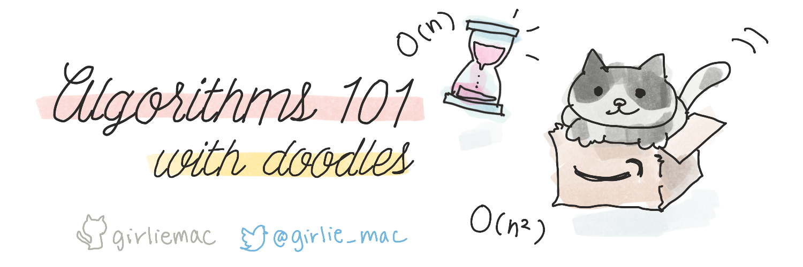

# Doodles-as-A-Service Repo

[![CC BY-SA 4.0][cc-by-sa-shield]][cc-by-sa]

👋 Aloha, this is where you can grab most of my tech doodles and sketchnotes.

I have been posting my tech doodles on [Twitter](https://twitter.com/girlie_mac) and [Microsoft open-source projects](https://github.com/microsoft/) and I am repeatedly asked where to get the original images, especially from people who saw some of my works out of context on some social media, so I decided to put all together on one GitHub repo.

Here are some of the latest digitally created handdrawn doodles, as well as photos of analog ones.

All my doodles are under Creative Commons license, so please share with attributions. And I definitely don't want you to NFT them without my permission (and I won't permit you because you don't own them. They are open-sourced to be freely available for educational purpose only!)

Enjoy 🌺

---

## Algorithms
[/algorithms](/algorithms)

```
└── 📁algorithms
    ├── 📁png
    │   ├── 📄algorithm101_file.png
    │   └── 📄...
    └── 📁tiff
        ├── 📄algorithm101_file.tiff
        └── 📄...
```

1. Big O Notation: O(n)
2. Big O Natation: O(1) and O(n²)
3. Data Structures: Array
4. Data Structures: Linked List
5. Data Structures: Stack
6. Data Structures: Queue
7. Data Structures: Hash Table (1/2)
8. Data Structures: Hash Table (2/2)
9. Data Structures: Binary Heap (1/2)
10. Data Structures: Binary Heap (2/2)
11. Data Structures: Binary Search Tree (1/2)
12. Data Structures: Binary Search Tree (2/2)

---

## Web Development for Beginners
[/webdev](/webdev)

These images are created for the project at Microsoft I was in, [Web Dev for Beginners](https://github.com/microsoft/Web-Dev-For-Beginners)
curriculum. 

```
└── 📁webdev
    ├── 📁png
    │   ├── webdev101-programmingml-history.png
    │   └── 📄...
    └── 📁tiff
        ├── 📄webdev101-programming.tiff
        └── 📄...
```

1. Introduction to Programming Languages and Tools of the Trade 
2. Introduction to GitHub
3. Creating Accessible Webpages
4. JavaScript Basics: Data Types
5. JavaScript Basics: Methods and Functions
6. JavaScript Basics: Making Decisions
7. JavaScript Basics: Arrays and Loops
8. Introduction to HTML
9. Introduction to CSS
10. DOM Manipulation and a Closure

---

## Machine Learning for Beginners
[/ml](/ml)

These images are created for another project at Microsoft I was in, [Machine Learning for Beginners](https://github.com/microsoft/ML-For-Beginners)
curriculum. 

```
└── 📁ml
    ├── 📁png
    │   ├── 📄ml-history.png
    │   └── 📄...
    └── 📁tiff
        ├── 📄ml-history.tiff
        └── 📄...
```

1. Machine Learning history
1. Faireness in ML
1. Regression
1. Reinforcement
1. Time series
1. ML in the real world

---

## Git Purr - Git Explained with Cats!
[/git-purr](/git-purr)

This series is my ealier work and everything is drawn in very analog way. 

I am planning to recreate digitally someday. Git cherrypick is the only one that digitally handdrawn after I got an iPad with Pencil.

```
└── 📁git-purr
    ├── 📄git-purr.jpg   
    └── 📄...

```

1. git purr (git pull)
1. git meowge (git merge & git rebase)
1. git puss (git push)
1. git cherry-pick & git log

---

### Microsoft Teams
[/teams](/teams)

```
└── 📁teams
    ├── 📄teams-toolkit-v3-doodle.png  
    └── 📄...

```
1. What's New in Teams Toolkit v3

---

## Live Sketchnotes from Conferences and Classes
[/sketchnotes](/sketchnotes)

These are some of my old sketchnotes from the past. I don't have all of my drawings but post as I find somewhere in my HD or cloud spaces.

```
└── 📁sketchnotes  
    └── 📄...

```
---

## HTTP Status Cats 🐱

This is one of my first personal project to make technology into cats. Although this is *not* doodling, I thought it was worth mentioning here!

All HTTP Cats are now hosted at [HTTP.cat](https://http.cat) because the domain name is awesome.

All images (except a few) are originally created by me a decade ago! Read the story on [Know Your Meme](https://knowyourmeme.com/memes/http-status-cats)

---

## Slack API Zine
[/slack](/slack)

```
└── 📁slack  
    └── 📄...

```

These are something I did while working at Slack. I created the zine (as physical printed books) to be distribute at Slack-sponsored events and conferences, but never get fully approved. Well, the global pandemic forced us to give up all in-person events anyway.

The content is outdated as of 2022 so view them with cautions.

## 🖨 Printing

> ⚠️ Updated on August 27, 2021: 
> 
> GitHub warned me that my Git LFS is disabled as the bandwidth exceeded  exceeded your data plan by 150%+.
> So now the high-res version in TIFF is temporary unavailable. I will move them somewhere when I have time. 
> Thank you! 
> 🙇‍♀️

~~The *tiff* files are for printing. I set them in 5.83 x 8.27 inches, which should fit in A5 paper size.
They are large files and stored as LFS files so you won't download the actual files when you `git clone` so please download manually from GitHub.~~

---

This work is licensed under a [Creative Commons Attribution-ShareAlike 4.0
International License][cc-by-sa].

[![CC BY-SA 4.0][cc-by-sa-image]][cc-by-sa]

[cc-by-sa]: https://creativecommons.org/licenses/by-sa/4.0/
[cc-by-sa-image]: https://licensebuttons.net/l/by-sa/4.0/88x31.png
[cc-by-sa-shield]: https://img.shields.io/badge/License-CC%20BY--SA%204.0-lightgrey.svg
